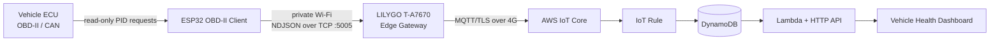
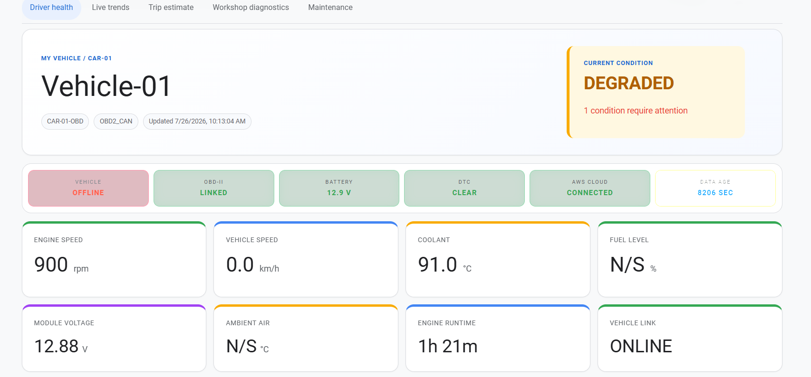

# Connected Vehicle Health Platform

[](https://github.com/wattagent-lgtm/connected-vehicle-health-platform/actions)
[](LICENSE)
[](SECURITY.md)

A complete connected-car reference platform built around an ESP32 OBD-II
client, a LILYGO T-A7670 4G edge gateway and AWS serverless services. It was
validated with a Nissan X-Trail T32 2.5 L (2015), while standard SAE J1979
functions remain applicable to other compliant vehicles.

> This is a monitoring and laboratory system, not a certified diagnostic or
> vehicle-control product. The firmware intentionally enforces a read-only
> boundary.

## What is included

| Layer | Technology | Responsibility |
|---|---|---|
| Vehicle edge | ESP32, ESP-IDF, TWAI/CAN | Poll Mode 01 PIDs, read Mode 03 DTCs, validate and classify samples |
| Field gateway | LILYGO T-A7670, MicroPython | Private Wi-Fi AP, TCP ACK, bounded MQTT queue and 4G backhaul |
| Messaging | AWS IoT Core MQTT/TLS | Device identity, UNS topics and routing |
| Storage | DynamoDB | Time-ordered vehicle telemetry |
| Application | Lambda + API Gateway | Merge data classes, health rules, trip/fuel and maintenance estimates |
| HMI | HTML/CSS/JavaScript | Responsive driver, trend, diagnostic and maintenance views |

## Architecture



The gateway returns `{"status":"OK"}` after validating and queueing each TCP
message. LTE/AWS latency therefore does not block the vehicle client.

## Repository map

```text
.
|-- esp-obd2-client/                 ESP-IDF vehicle firmware
|-- gateway/lilygo-micropython/      MicroPython 4G gateway
|-- aws-dashboard/                   SAM backend and browser HMI
|-- docs/                            Architecture, data and operating guides
|-- examples/payloads/               Versioned message examples
|-- .github/workflows/quality.yml    Public CI checks
|-- SECURITY.md                      Safety and credential policy
`-- LICENSE
```

## Telemetry model

The client groups parameters by engineering rate instead of sending one MQTT
message per PID:

| Class | Typical period | Examples |
|---|---:|---|
| `fast` | 0.5-1 s | RPM, speed, throttle, engine load |
| `slow` | 5-30 s | coolant, intake air, fuel level, module voltage |
| `event` | on change | ignition, connectivity, threshold transition |
| `diagnostic` | 30-300 s/on request | supported PIDs, DTCs, client health |

Example topic:

```text
dt/iiot-lab/factory1/vehicle/obd2-vehicle/car-01-obd/telemetry/fast
```

See [Data Model](docs/DATA_MODEL.md) and
[OBD-II Data Reference](docs/OBD2_DATA_REFERENCE.md).

## Quick start

### 1. Build the OBD-II client

Open an **ESP-IDF 5.5 PowerShell**:

```powershell
cd C:\path\to\connected-vehicle-health-platform\esp-obd2-client
idf.py menuconfig
idf.py build
idf.py -p COM6 flash monitor
```

Set Wi-Fi, gateway `192.168.4.1:5005`, GPIOs and simulator mode in
`OBD-II Wi-Fi Client`. Start with the simulator. Disable it only after the
bench checks in [Test Plan](docs/TEST_PLAN.md).

### 2. Deploy the gateway

Copy `gateway/lilygo-micropython/config.py` and replace every `YOUR_...` or
`CHANGE_ME` value locally. Install the three AWS IoT certificate files on the
device; never commit them.

```powershell
cd gateway\lilygo-micropython
mpremote connect COM3 fs cp *.py :
mpremote connect COM3 fs mkdir :www
mpremote connect COM3 fs cp www\index.html :www/index.html
mpremote connect COM3 fs cp www\style.css :www/style.css
mpremote connect COM3 fs cp www\app.js :www/app.js
mpremote connect COM3 reset
```

If PowerShell wildcard copy is unsupported by the installed `mpremote`,
copy each `.py` file individually.

### 3. Deploy AWS

Install AWS CLI and AWS SAM CLI, configure a non-root deployment identity, then:

```powershell
cd aws-dashboard
sam build
sam deploy --guided
```

Use the outputs to configure the IoT rule and dashboard. Full instructions are
in [Deployment Guide](docs/DEPLOYMENT.md).

## Dashboard capabilities

- Online, stale and offline state with explicit data age
- RPM, speed, coolant, fuel, voltage and engine-runtime cards
- Live trends for powertrain parameters
- Standard PID support matrix and DTC display
- Health warnings with evidence rather than a decorative score
- Trip distance/fuel estimates with confidence and coverage
- Predictive-maintenance indicators based on transparent rules
- Nissan-specific/CONSULT section clearly separated from SAE standard data

## HMI preview



The dashboard separates driver health, live engineering trends, trip
estimation, workshop diagnostics and maintenance into task-focused views.
See the complete [HMI Screenshot Gallery](docs/HMI_GALLERY.md).

## Engineering limits

- Standard OBD-II does not guarantee fuel level, ambient temperature, MAF or
  every parameter on every vehicle. `N/S` means **not supported**, not zero.
- Trip and fuel values are estimates; calibration and coverage are shown.
- Nissan proprietary services require independently verified request/response
  definitions. They are disabled by default.
- Cloud status is not evidence of current vehicle status; data age is always
  evaluated independently.

## Documentation

- [System Architecture](docs/ARCHITECTURE.md)
- [Interconnection](docs/INTERCONNECTION.md)
- [OBD-II Data Reference](docs/OBD2_DATA_REFERENCE.md)
- [Data Model and API](docs/DATA_MODEL.md)
- [Dashboard/HMI](docs/HMI_DASHBOARD.md)
- [HMI Screenshot Gallery](docs/HMI_GALLERY.md)
- [Deployment Guide](docs/DEPLOYMENT.md)
- [Verification and Soak Test](docs/TEST_PLAN.md)
- [Operating Limits and Qualification](docs/OPERATING_LIMITS.md)
- [Nissan T32 CONSULT Research Phase](docs/NISSAN_T32_CONSULT_READ_ONLY_INTEGRATION.md)
- [Security and Safety](SECURITY.md)

## License

MIT. Vehicle manufacturer trademarks and proprietary diagnostic definitions
are not included or licensed by this repository.
