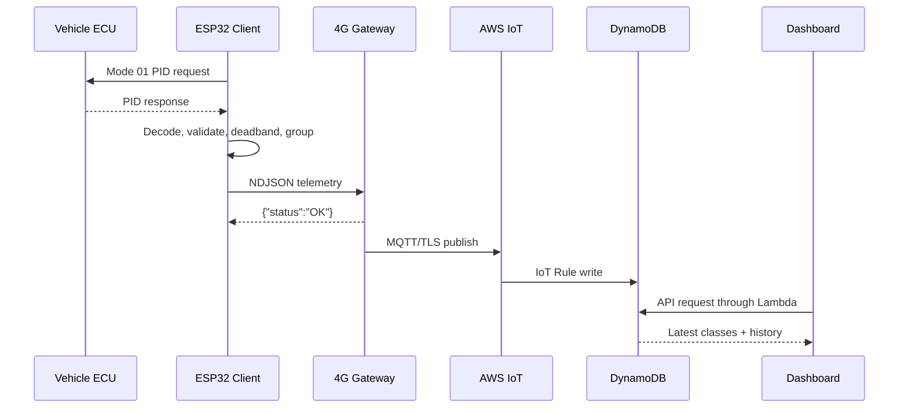

# System Architecture

## Design goals

The platform separates vehicle acquisition, field transport and cloud
analytics so a failure in LTE or AWS does not disturb CAN acquisition.

1. The ESP32 requests only approved read-only data.
2. Sampling groups execute at independent rates.
3. The gateway validates JSON and acknowledges TCP immediately.
4. A bounded asynchronous queue absorbs normal LTE jitter.
5. AWS persists immutable observations and calculates presentation models.
6. The dashboard exposes stale/offline state and data provenance.

## Runtime flow



## Failure domains

| Failure | Required behavior |
|---|---|
| ECU PID unsupported | Mark `supported=false`; do not invent zero |
| Vehicle ignition off | Back off requests, publish transition, reconnect safely |
| Wi-Fi/TCP interruption | Reconnect with bounded exponential delay |
| LTE interruption | Keep TCP responsive; queue within configured RAM limit |
| MQTT queue full | Apply configured drop/coalesce policy and increment counters |
| Cloud API error | Dashboard retains last valid view and shows API error/data age |
| Stale telemetry | State changes to `STALE`, then `OFFLINE` |

## Capacity principle

Message rate is not tag rate. Ten fast PIDs can be grouped in one message:

```text
payload_bytes_per_second =
    messages_per_second * average_serialized_payload_bytes

monthly_cellular_bytes ≈
    (payload + MQTT + TCP/IP + TLS amortization) * seconds_online
```

Measure real encoded messages and modem counters because TLS handshakes,
retries and network framing vary by carrier.
