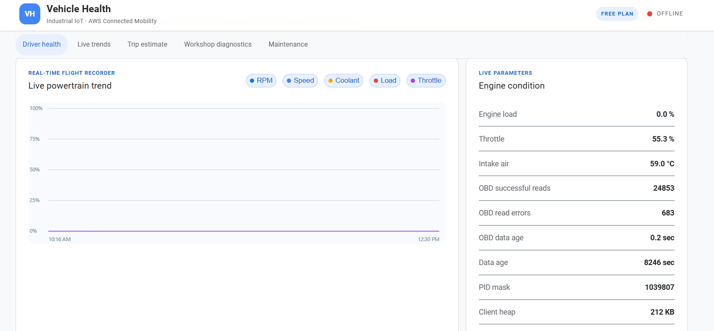
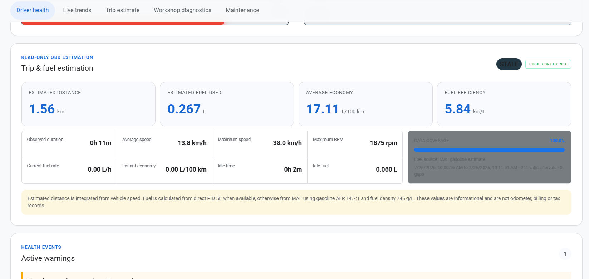
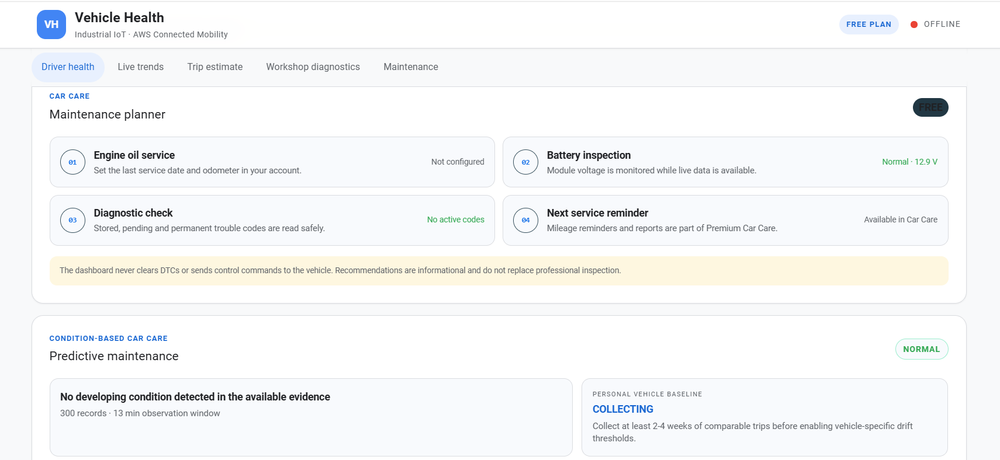
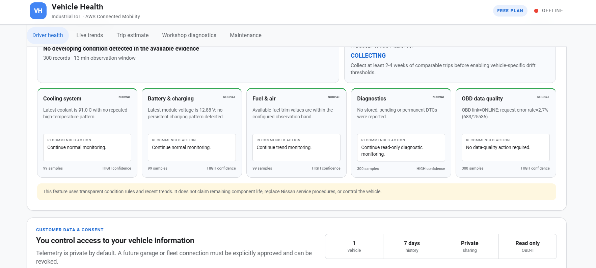

# Vehicle Health HMI Screenshot Gallery

This gallery records the responsive web HMI implemented by the reference
platform. The screens use a light, high-contrast visual system inspired by
modern Google product colors while preserving engineering status semantics.

The HMI is informational and read-only. It never clears DTCs, changes ECU
settings or sends vehicle-control commands.

## 1. Driver health

The landing view answers the driver's immediate questions:

- Is the vehicle data current, stale or offline?
- Is the OBD-II link active?
- Is module voltage within the configured band?
- Are any DTCs present?
- Which live values are available or unsupported?

`N/S` means the PID is not supported or not available in the current dataset.
It must not be interpreted as zero. Vehicle status and AWS connectivity are
shown separately because cloud connectivity does not prove that vehicle data
is fresh.

## 2. Live trends

The trend page normalizes RPM, speed, coolant, load and throttle for a shared
plot while preserving the engineering values in the live-parameter panel. It
also exposes OBD successful reads, read errors, data age, supported-PID mask
and ESP32 heap to distinguish a vehicle condition from a data-quality problem.

## 3. Trip and fuel estimation

Distance is integrated from valid vehicle-speed samples. Fuel is calculated
from a direct fuel-rate PID when available, otherwise estimated from MAF using
the documented gasoline air-fuel ratio and density assumptions. The HMI shows
coverage, confidence, valid intervals and gaps so estimates are not presented
as odometer, billing or tax records.

## 4. Maintenance planner

The maintenance view combines owner-entered service history with measurable
conditions such as module voltage and diagnostic-code state. Mileage-based
reminders require an odometer or owner-supplied service baseline; inferred
trip distance is not silently substituted for certified odometer mileage.

## 5. Predictive maintenance and consent

Predictive-maintenance cards report evidence, sample counts, confidence and a
recommended action for cooling, charging, fuel/air, diagnostics and OBD data
quality. The feature uses transparent rules and recent trends; it does not
claim remaining component life or replace Nissan service procedures.

The customer-data panel makes the intended commercial boundary explicit:
telemetry is private by default, access is read-only, and any future garage or
fleet sharing must be explicitly approved and revocable.

## Status color semantics

| Color | Meaning |
|---|---|
| Green | Normal, linked or confirmed |
| Blue | Informational measurement or cloud/application state |
| Amber | Stale, unsupported, incomplete or attention required |
| Red | Offline, failed or safety-relevant warning |
| Purple | Electrical/module-voltage information |

Color is never the only status signal; every state also includes text.

## Source implementation

The deployable frontend is in
[`aws-dashboard/frontend/`](../aws-dashboard/frontend/). Backend aggregation,
health logic and estimation are in
[`aws-dashboard/backend/car_health_api/`](../aws-dashboard/backend/car_health_api/).
For field definitions and limitations, see
[HMI Dashboard](HMI_DASHBOARD.md), [Data Model](DATA_MODEL.md), and
[OBD-II Data Reference](OBD2_DATA_REFERENCE.md).
